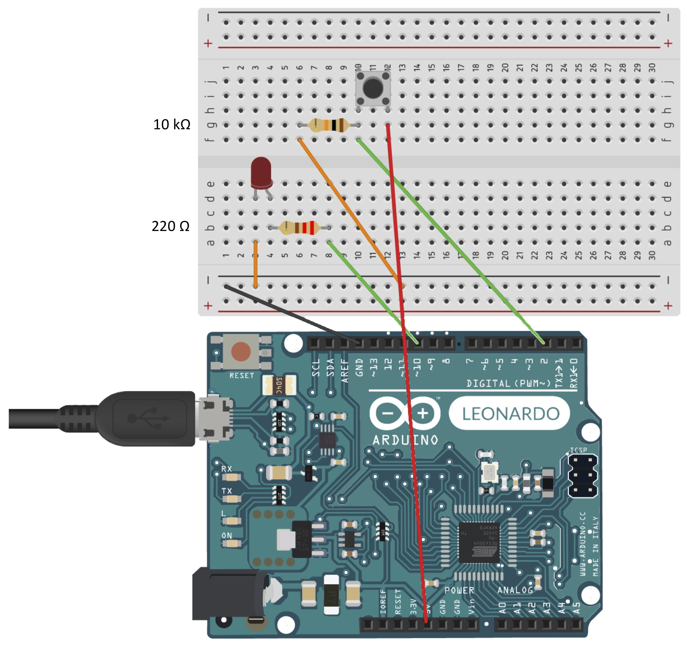

# triggerino

Arduino based mock trigger device to use for developing fMRI stimulation code (in case you need to sync your stimulation with the MRI triggers).

---

Basic use: while the button is pressed, it will flash the led and send a letter (e.g., a 't') every x msec (e.g., 1800 msec) to the connected computer.

## Code

In `triggerino.ino` set the trigger key and the TR according to your need (see example below)

``` c++
// set trigger key
char triggerKey = 't';

// set TR in msec
int TR = 1800;
```

## Circuit



Elements you need:

- Arduino Leonardo (compared to the classic Arduino UNO, computers and Matlab see it as an external keyboard)

- micro USB cable

- breadboard

- 6 jumpers

- 1 basic led

- 1 basic button

- 2 resistors (220 Ω and 10 kΩ)

## How to use it

`sandbox_getTrigger.m` is a PsychtoolbBox based script that waits for the Arduino input (a keyboard stroke) to do something.
